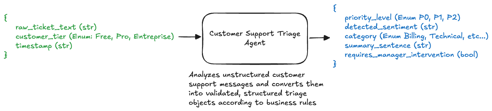

# 2. Controlled Schema Input and Output (Google ADK)




This project demonstrates how to build a production-grade agent using the **Google Agent Development Kit (ADK)** where both **input data** and **output responses** strictly adhere to user-defined schemas using **Pydantic** and **Enums**.

The reference use case implemented here is an **Intelligent Customer Support Triage Engine** (`customer_support_triage`), which analyzes unstructured customer support messages and converts them into validated, structured triage objects according to business rules and SLAs.

---

## Directory Overview

```
2_controlled_schema_input_and_output/
├── agents/
│   └── customer_support_triage/
│       ├── .env                # Environment variables (Gemini API key / Project configuration)
│       ├── agent.py            # ADK Agent definition with output_schema binding
│       ├── main.py             # FastAPI service managing session state and execution
│       ├── prompt.py           # System instructions, triage business rules, and prompt template
│       └── schema.py           # Pydantic models and Enums for input & output schemas
├── tests/
│   └── customer_support_triage/
│       └── test.py             # Unit/integration tests (Enterprise, Free tier, and validation)
├── utils/
│   └── logging.py              # Colored and structured logging configuration
└── requirements.txt            # Python dependencies (google-adk, coloredlogs, fastapi, etc.)
```

---

## Key Concepts & Architecture

### 1. Controlled Input Schema (`SupportTicketInput`)

Incoming customer inquiries are validated against a strict Pydantic model before reaching the agent:

  - `raw_ticket_text` (`str`): The raw, unstructured support message.
  - `customer_tier` (`CustomerTier` Enum: `Free`, `Pro`, `Enterprise`): The subscription tier of the user.
  - `timestamp` (`str`): ISO 8601 submission timestamp.

```python
class CustomerTier(str, Enum):
    FREE = "Free"
    PRO = "Pro"
    ENTERPRISE = "Enterprise"

class SupportTicketInput(BaseModel):
    raw_ticket_text: str = Field(..., description="The full, unstructured text of the customer's support request.")
    customer_tier: CustomerTier = Field(..., description="The subscription level of the customer, used to help determine priority.")
    timestamp: str = Field(..., description="The ISO 8601 timestamp of when the ticket was submitted.")
```

#### How Input is Passed to the ADK Agent:
1. **API Validation**: FastAPI validates incoming JSON against `SupportTicketInput`, returning HTTP 422 if fields are missing or invalid.
2. **Session State Injection**: In `main.py`, `ticket_input.model_dump()` is loaded directly into the ADK session state:
   ```python
   session = await service.create_session(
       app_name=APP_NAME,
       user_id=user_id,
       session_id=session_id,
       state=ticket_input.model_dump()
   )
   ```
3. **Template Context Binding**: `prompt.py` accesses state variables (`{raw_ticket_text}`, `{customer_tier}`, `{timestamp}`) within the system prompt.

---

### 2. Controlled Output Schema (`SupportTriageOutput`)

The agent is constrained to produce structured JSON matching `SupportTriageOutput`:

  - `priority_level` (`PriorityLevel` Enum: `P0`, `P1`, `P2`): Calculated priority based on SLA and severity.
  - `detected_sentiment` (`str`): Single-word emotional state (e.g., `Frustrated`, `Neutral`, `Urgent`).
  - `category` (`TicketCategory` Enum: `Billing`, `Technical`, `Feature_Request`, `Account_Access`, `Other`).
  - `summary_sentence` (`str`): Single objective sentence (< 20 words) summarizing the core issue.
  - `requires_manager_intervention` (`bool`): Flag triggered by legal threats, cancellation intent, or extreme hostility.

```python
class PriorityLevel(str, Enum):
    P0 = "P0"  # Critical/Immediate
    P1 = "P1"  # High Priority
    P2 = "P2"  # Normal/Routine

class TicketCategory(str, Enum):
    BILLING = "Billing"
    TECHNICAL = "Technical"
    FEATURE_REQUEST = "Feature_Request"
    ACCOUNT_ACCESS = "Account_Access"
    OTHER = "Other"

class SupportTriageOutput(BaseModel):
    priority_level: PriorityLevel
    detected_sentiment: str
    category: TicketCategory
    summary_sentence: str
    requires_manager_intervention: bool = Field(default=False)
```

#### Binding Output Schema to ADK Agent:
In [`agents/customer_support_triage/agent.py`] , the `output_schema` parameter is passed directly to the `Agent`:

```python
from google.adk.agents.llm_agent import Agent
from agents.customer_support_triage.prompt import system_instruction
from agents.customer_support_triage.schema import SupportTriageOutput

customer_support_triage = Agent(
    model='gemini-2.5-flash',
    name='customer_support_triage',
    description='An intelligent agent for triaging customer support tickets.',
    instruction=system_instruction,
    output_schema=SupportTriageOutput,
)
```
This forces Gemini to generate structured output conforming to the schema and enum definitions.

---

### 3. Triage Rules & Prompt Design (`agents/customer_support_triage/prompt.py`)

The prompt defines clear operational guidelines for the LLM:
* **Priority Mapping**:
  - `P0`: Enterprise service outages, security breaches, legal threats.
  - `P1`: Pro customer technical issues, urgent billing or account access issues.
  - `P2`: General inquiries, feature requests, Free tier non-blockers.
* **Sentiment & Category Classification**: Restricts categories and sentiments to predefined standards.
* **Manager Intervention Trigger**: Strict criteria for setting `requires_manager_intervention = true`.

---

### 4. FastAPI Service (`agents/customer_support_triage/main.py`)

Provides a REST endpoint (`POST /run-customer-support-triage`) that:
1. Accepts and validates `SupportTicketInput`.
2. Generates unique per-request session IDs and user IDs.
3. Initializes an `InMemorySessionService` and ADK `Runner`.
4. Executes the agent and parses the response into JSON.
5. Returns a structured response:
   ```json
   {
     "status": "success",
     "results": [
       {
         "priority_level": "P0",
         "detected_sentiment": "Urgent",
         "category": "Account_Access",
         "summary_sentence": "Enterprise customer is locked out of admin account due to password reset failure.",
         "requires_manager_intervention": false
       }
     ]
   }
   ```

---

## Testing (`tests/customer_support_triage/test.py`)

The test suite validates both the business logic and schema enforcement:

1. **Enterprise Urgent Outage (`test_run_customer_support_triage_enterprise_urgent`)**:
   - Sends an Enterprise account lockout request.
   - Asserts response status is `200`, priority is `P0` or `P1`, and category is `Account_Access`.
2. **Free Tier Routine Query (`test_run_customer_support_triage_free_billing`)**:
   - Sends a routine billing inquiry from a Free tier customer.
   - Asserts category is `Billing` and priority is non-critical (`P2` / not `P0`).
3. **Input Schema Validation (`test_invalid_input_validation`)**:
   - Sends a payload missing required fields (`customer_tier`, `timestamp`).
   - Verifies that FastAPI/Pydantic returns HTTP `422 Unprocessable Entity`.

---

## Getting Started

### 1. Prerequisites & Installation

Ensure you have Python 3.10+ installed.

```bash
pip install -r requirements.txt
```

Set up your Gemini API credentials in `agents/customer_support_triage/.env`:
```bash
GEMINI_API_KEY="your-api-key"
```

---

### 2. Running Tests

Run the unit and integration tests:

```bash
python3 -m unittest tests/customer_support_triage/test.py
```

---

### 3. Running the FastAPI Server

Start the server using Uvicorn:

```bash
python3 -m agents.customer_support_triage.main
```
Or:
```bash
uvicorn agents.customer_support_triage.main:api --host 127.0.0.1 --port 8000 --reload
```

Interactive API documentation will be available at:
- Swagger UI: `http://127.0.0.1:8000/docs`
- Redoc: `http://127.0.0.1:8000/redoc`

---

### 4. Example API Request

```bash
curl -X POST "http://127.0.0.1:8000/run-customer-support-triage" \
     -H "Content-Type: application/json" \
     -d '{
       "raw_ticket_text": "Our payment failed for our enterprise subscription renewal and our team is facing downtime.",
       "customer_tier": "Enterprise",
       "timestamp": "2026-08-20T10:00:00Z"
     }'
```
