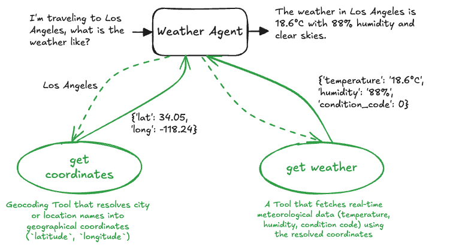

# 3. Custom Function Calling (Google ADK)



This project demonstrates how to build and integrate **custom Python functions as tools** within the **Google Agent Development Kit (ADK)**. It showcases how an LLM agent dynamically selects, invokes, and chains custom tools based on the user's query.

The reference use case implemented here is a **Weather Agent** (`weather_agent`), which answers natural language weather queries by chaining two distinct custom tools:
1. **Geocoding Tool (`get_coordinates`)**: Resolves city or location names into geographical coordinates (`latitude`, `longitude`).
2. **Weather Tool (`get_weather`)**: Fetches real-time meteorological data (temperature, humidity, condition code) using the resolved coordinates.

---

## Directory Overview

```
3_custom_function_calling/
├── agents/
│   └── weather_agent/
│       ├── .env                # Environment variables (Gemini API key / Project configuration)
│       ├── agent.py            # ADK Agent definition with registered custom tools
│       ├── main.py             # FastAPI service managing session state and execution
│       ├── prompt.py           # System instructions guiding tool usage and response formatting
│       └── tools.py            # Custom Python tool definitions (Open-Meteo API integrations)
├── tests/
│   └── weather_agent/
│       └── test.py             # Integration tests for health check and query execution
├── utils/
│   ├── logging.py              # Colored and structured logging configuration
│   └── utils.py                # Environment variable helper utilities
└── requirements.txt            # Python dependencies (google-adk, fastapi, requests, uvicorn, etc.)
```

---

## How Custom Tools are Built & Used

### 1. Defining Custom Tools (`agents/weather_agent/tools.py`)

In Google ADK, any standard Python function can be used as a tool by adhering to two key conventions:
* **Type Annotations**: Specify parameter and return types so ADK can generate the tool's JSON schema for Gemini.
* **Docstrings**: Provide clear descriptions of the tool's purpose, arguments, and return values. Gemini reads these docstrings to decide **when** and **how** to call the tool.

#### Tool 1: Geocoding (`get_coordinates`)
Fetches geographic coordinates for a given location using the Open-Meteo Geocoding API:

```python
def get_coordinates(location: str):
    """Get latitude and longitude for a string location.

    Args:
        location (str): The location to get the coordinates for.

    Returns:
        dict: A dictionary containing the latitude, longitude, name, and country of the location.
    """
    url = "https://geocoding-api.open-meteo.com/v1/search"
    params = {"name": location, "count": 1, "language": "en", "format": "json"}
    try:
        response = requests.get(url, params=params)
        response.raise_for_status()
        data = response.json()
        
        if not data.get("results"):
            return {"error": f"Location '{location}' not found."}
        
        result = data["results"][0]
        return {
            "latitude": result["latitude"],
            "longitude": result["longitude"],
            "name": result["name"],
            "country": result.get("country")
        }
    except Exception as e:
        return {"error": str(e)}
```

#### Tool 2: Weather Forecast (`get_weather`)
Retrieves temperature, relative humidity, and weather condition codes for specific coordinates:

```python
def get_weather(latitude: float, longitude: float):
    """Get weather for specific coordinates.

    Args:
        latitude (float): The latitude of the location.
        longitude (float): The longitude of the location.

    Returns:
        dict: A dictionary containing the temperature, humidity, and condition code of the location.
    """
    url = "https://api.open-meteo.com/v1/forecast"
    params = {
        "latitude": latitude,
        "longitude": longitude,
        "current": ["temperature_2m", "relative_humidity_2m", "weather_code"],
        "timezone": "auto"
    }
    try:
        response = requests.get(url, params=params)
        response.raise_for_status()
        data = response.json()
        current = data.get("current", {})
        
        return {
            "temperature": f"{current.get('temperature_2m')}°C",
            "humidity": f"{current.get('relative_humidity_2m')}%",
            "condition_code": current.get("weather_code")
        }
    except Exception as e:
        return {"error": str(e)}
```

---

### 2. Registering Tools with the Agent (`agents/weather_agent/agent.py`)

Tools are registered with the ADK `Agent` simply by passing the Python functions in the `tools` list:

```python
from google.adk.agents.llm_agent import Agent
from agents.weather_agent.tools import get_coordinates, get_weather
from agents.weather_agent.prompt import system_instruction

weather_agent = Agent(
    model='gemini-2.5-flash',
    name='weather_agent',
    description='A helpful assistant that answers user questions about the weather.',
    instruction=system_instruction,
    tools=[get_coordinates, get_weather],
)
```

---

### 3. Tool Chaining & Reasoning Flow (`agents/weather_agent/prompt.py`)

The system prompt instructs the agent on the multi-step execution flow:

```
You are a helpful assistant that answers user questions about the weather.

You have access to tools `get_coordinates` and `get_weather`. 
The user is asking for the weather in a specific location.

Follow the following steps to answer the user's question:
1. Call `get_coordinates` with the location name to get the latitude and longitude.
2. Call `get_weather` with the latitude and longitude to get the weather.
3. Format the weather information in a user-friendly way.
```

---

### 4. FastAPI Service (`agents/weather_agent/main.py`)

The application is wrapped with **FastAPI** to expose REST endpoints:
* `GET /`: Health check endpoint.
* `POST /run-weather-agent`: Accepts a user query (e.g. `query="What is the weather in Tokyo?"`), manages the ADK `Runner` and `InMemorySessionService`, and returns the agent's answer.

---

### 5. Integration Testing (`tests/weather_agent/test.py`)

The test script uses FastAPI's `TestClient` to verify the end-to-end flow:
* **Health Check**: Ensures the service is operational.
* **Tool Invocation & Chaining**: Sends natural language queries (e.g., *"What is the weather like in Paris?"*, *"I'm traveling to Los Angeles, what is the weather like?"*) and verifies that the agent successfully executes both tools to return valid weather information.

---

## Getting Started

### 1. Prerequisites & Installation

Ensure you have Python 3.10+ installed.

```bash
pip install -r requirements.txt
```

Set up your Gemini API credentials in `agents/weather_agent/.env`:
```bash
GEMINI_API_KEY="your-api-key"
```

---

### 2. Testing Tools Directly

You can test the tool definitions and Open-Meteo API integrations independently without running the agent or API server:

```bash
python3 agents/weather_agent/tools.py
```

---

### 3. Running Integration Tests

Run the FastAPI test suite:

```bash
python3 tests/weather_agent/test.py
```

---

### 4. Running the FastAPI Server

Start the backend API server:

```bash
python3 -m agents.weather_agent.main
```
Or with Uvicorn:
```bash
uvicorn agents.weather_agent.main:api --host 0.0.0.0 --port 8000 --reload
```

Interactive documentation:
- Swagger UI: `http://localhost:8000/docs`
- Redoc: `http://localhost:8000/redoc`

---

### 5. Example API Request

```bash
curl -X POST "http://localhost:8000/run-weather-agent?query=What%20is%20the%20weather%20in%20London?"
```
