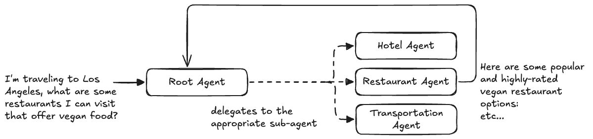

# 4. Hierarchical Agent (Google ADK)



This project demonstrates how to build a **Hierarchical Multi-Agent Architecture** using the **Google Agent Development Kit (ADK)**.

In a hierarchical architecture, a top-level **Root Coordinator Agent** dynamically manages and delegates specialized travel planning queries across dedicated **Subagents** (`hotel_agent`, `restaurant_agent`, and `transportation_agent`) using ADK's native `sub_agents` orchestration mechanism.

---

## Multi-Agent Architecture Comparison in ADK

| Pattern | Class / Structure | Control & Execution Model | Delegation & Handoff Mechanism |
| :--- | :--- | :--- | :--- |
| **Hierarchical** (`4_hierarchical_agent`) | `Agent(sub_agents=[...])` | **Dynamic LLM orchestration & delegation**. | **In-memory conversational context & subagent calls**. |
| **Agent as a Tool** (`5_agent_as_a_tool`) | `Agent(tools=[AgentTool(...)])` | Subagents exposed as callable function tools. | `tool_context.state` dictionary. |
| **Sequential** (`6_sequential_agent`) | `SequentialAgent(sub_agents=[...])` | Linear, deterministic step-by-step pipeline. | `output_schema` $\rightarrow$ `input_schema` binding. |
| **Parallel + Synthesis** (`7_parallel_agent`) | `ParallelAgent` + `SequentialAgent` | Concurrent fan-out + fan-in synthesis. | `output_key` state accumulation $\rightarrow$ prompt template injection. |
| **Router Agent** (`8_router_agent`) | `Agent(output_schema=...)` + REST APIs | Dynamic intent classification & branching. | Pydantic Enum Output $\rightarrow$ REST/HTTP Dispatch. |

---

## Directory Overview

```
4_hierarchical_agent/
├── agent.png                   # Architecture diagram
├── agent.excalidraw            # Design diagram source
├── agents/
│   ├── hotel_agent/
│   │   ├── agent.py            # Hotel specialist agent definition
│   │   └── prompt.py           # Hotel domain instructions
│   ├── restaurant_agent/
│   │   ├── agent.py            # Restaurant specialist agent definition
│   │   └── prompt.py           # Dining & cuisine domain instructions
│   ├── transportation_agent/
│   │   ├── agent.py            # Transportation specialist agent definition
│   │   └── prompt.py           # Transit & travel domain instructions
│   └── root_agent/
│       ├── agent.py            # Root agent with sub_agents=[hotel, restaurant, transportation]
│       ├── main.py             # FastAPI service running the hierarchical agent
│       └── prompt.py           # Orchestration and delegation instructions
├── tests/
│   └── root_agent/
│       └── test.py             # Integration tests verifying delegation across subagents
└── utils/
    ├── logging.py              # Colored and structured logging configuration
    └── utils.py                # Environment configuration helper utilities
```

---

## How It Works: Hierarchical Delegation

```
                            User Travel Request
                                     │
                                     ▼
                      ┌──────────────────────────────┐
                      │          Root Agent          │
                      │  (Coordinator/Orchestrator)  │
                      └──────────────┬───────────────┘
                                     │
        ┌────────────────────────────┼────────────────────────────┐
        │                            │                            │
        ▼                            ▼                            ▼
┌──────────────────┐         ┌──────────────────┐         ┌──────────────────┐
│   Hotel Agent    │         │ Restaurant Agent │         │  Transportation  │
│   (Subagent)     │         │   (Subagent)     │         │      Agent       │
└────────┬─────────┘         └────────┬─────────┘         └────────┬─────────┘
         │                            │                            │
         └────────────────────────────┼────────────────────────────┘
                                      ▼
                      Combined Synthesized Response
```

---

## Core Components

### 1. Root Coordinator Agent (`agents/root_agent/agent.py`)

The `root_agent` acts as the primary orchestrator. Rather than containing low-level domain logic, it delegates work to specialized subagents declared in the `sub_agents` parameter:

```python
from google.adk.agents.llm_agent import Agent
from agents.root_agent.prompt import system_instruction
from agents.hotel_agent.agent import hotel_agent
from agents.restaurant_agent.agent import restaurant_agent
from agents.transportation_agent.agent import transportation_agent

root_agent = Agent(
    model='gemini-2.5-flash',
    name='root_agent',
    description='An agent that delegates to other agents to answer user questions.',
    instruction=system_instruction,
    sub_agents=[hotel_agent, restaurant_agent, transportation_agent],
)
```

#### Orchestration Prompt (`agents/root_agent/prompt.py`):
Instructs the coordinator on how to evaluate the request and route to the appropriate subagent(s):

```
You are a helpful assistant that answers user questions about travel plans to a specific location.

You have access to sub agents `hotel_agent` and `restaurant_agent` and `transportation_agent`. 
- `hotel_agent` finds hotels for user.
- `restaurant_agent` finds restaurants for user.
- `transportation_agent` finds transportation for user.

Follow the following steps to answer the user's question:
1. Determine which sub-agent(s) are needed to answer the user's question.
2. Call the appropriate sub-agent(s) to get the necessary information.
3. Combine the information from the sub-agents to answer the user's question.
```

---

### 2. Specialist Domain Subagents

Each subagent encapsulates domain-specific prompts and behaviors:

* **Hotel Subagent (`agents/hotel_agent/agent.py`)**:
  Focuses on hotel availability, lodging recommendations, and amenities:
  ```python
  hotel_agent = Agent(
      model='gemini-2.5-flash',
      name='hotel_agent',
      description='An agent that answers user questions about hotel availability in a given location.',
      instruction=system_instruction,
  )
  ```

* **Restaurant Subagent (`agents/restaurant_agent/agent.py`)**:
  Provides dining, cuisine, and food recommendations:
  ```python
  restaurant_agent = Agent(
      model='gemini-2.5-flash',
      name='restaurant_agent',
      description='A helpful assistant that retrieves restaurant recommendations based on cuisine type and optionally a location.',
      instruction=system_instruction,
  )
  ```

* **Transportation Subagent (`agents/transportation_agent/agent.py`)**:
  Handles flights, driving, trains, and intercity travel logistics:
  ```python
  transportation_agent = Agent(
      model='gemini-2.5-flash',
      name='transportation_agent',
      description='An agent that answers user questions about transportation options for getting from one location to another location.',
      instruction=system_instruction,
  )
  ```

---

### 3. FastAPI Service (`agents/root_agent/main.py`)

The hierarchical agent is served via a **FastAPI** REST API:
* `GET /`: Health check endpoint.
* `POST /run-root-agent`: Accepts `query: str`, initializes an `InMemorySessionService`, runs the ADK `Runner` configured with `root_agent`, and streams the hierarchical multi-turn execution events until a synthesized response is generated.

```json
{
  "status": "success",
  "results": {
    "response": "Here are some highly-rated vegan restaurants in Los Angeles: ..."
  }
}
```

---

### 4. Integration Testing (`tests/root_agent/test.py`)

Integration tests use FastAPI's `TestClient` to verify that the root coordinator correctly delegates to each subagent:
* **Transportation Query**: *"How can I get from New York to Los Angeles?"* $\rightarrow$ delegates to `transportation_agent`.
* **Hotel Query**: *"I'm traveling to Los Angeles, find me a hotel to stay in."* $\rightarrow$ delegates to `hotel_agent`.
* **Restaurant Query**: *"I'm traveling to Los Angeles, what are some restaurants I can visit that offer vegan food?"* $\rightarrow$ delegates to `restaurant_agent`.

---

## Getting Started

### 1. Prerequisites & Environment Setup

Ensure you have Python 3.10+ installed.

Set up your Gemini API credentials in `agents/root_agent/.env`:
```bash
GEMINI_API_KEY="your-api-key"
```

---

### 2. Running Integration Tests

Run the integration test suite:

```bash
python3 tests/root_agent/test.py
```

---

### 3. Running the FastAPI Server

Start the root agent API server:

```bash
python3 -m agents.root_agent.main
```
Or with Uvicorn:
```bash
uvicorn agents.root_agent.main:api --host 0.0.0.0 --port 8002 --reload
```

Interactive API documentation:
- Swagger UI: `http://localhost:8002/docs`
- Redoc: `http://localhost:8002/redoc`

---

### 4. Example API Request

```bash
curl -X POST "http://localhost:8002/run-root-agent?query=What%20are%20the%20best%20hotels%20and%20restaurants%20in%20San%20Francisco%3F"
```
