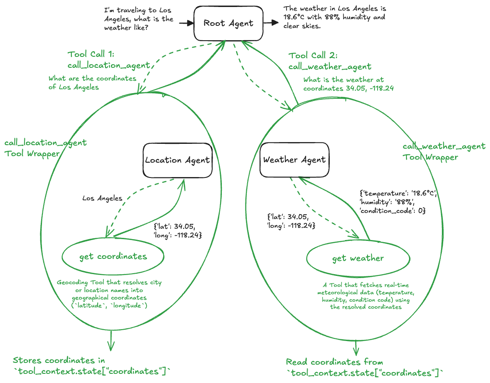

# 5. Agent as a Tool (Google ADK)



This project demonstrates the **Agent as a Tool** design pattern using the **Google Agent Development Kit (ADK)**.

In this architecture, specialized agents are wrapped and exposed to a root agent as **callable function tools** using `google.adk.tools.agent_tool.AgentTool` and `google.adk.tools.ToolContext`. This allows the root coordinator agent to invoke subagents deterministically, pass data between them, and maintain shared intermediate state across tool invocations.

---

## Agent as a Tool vs. Hierarchical Subagents

| Feature | Hierarchical Subagents (`sub_agents`) | Agent as a Tool (`AgentTool` + `ToolContext`) |
| :--- | :--- | :--- |
| **Integration** | Passed via `sub_agents=[agent_a, agent_b]` on `Agent`. | Wrapped via `AgentTool(agent)` and passed via `tools=[...]`. |
| **Control Flow** | LLM handles full delegation/routing between agent contexts. | Root agent treats other agents as standard function tools. |
| **State Sharing** | Context passed implicitly via conversation history. | Explicit state management using `tool_context.state` dictionary. |
| **Prompt Customization** | Subagent prompt is fixed. | Invoking tool can dynamically construct or augment prompts with previous tool outputs. |

---

## Directory Overview

```
5_agent_as_a_tool/
├── agents/
│   ├── location_agent/
│   │   ├── agent.py            # Location agent & call_location_agent tool wrapper
│   │   ├── prompt.py           # Instructions for location coordinate resolution
│   │   └── tools.py            # Geocoding tool (Open-Meteo Geocoding API)
│   ├── weather_agent/
│   │   ├── agent.py            # Weather agent & call_weather_agent tool wrapper
│   │   ├── prompt.py           # Instructions for coordinate-based weather retrieval
│   │   └── tools.py            # Weather forecast tool (Open-Meteo Forecast API)
│   └── root_agent/
│       ├── agent.py            # Root agent with tools=[call_location_agent, call_weather_agent]
│       ├── main.py             # FastAPI service running the root agent
│       └── prompt.py           # System instructions for tool execution sequencing
├── tests/
│   └── root_agent/
│       └── test.py             # Integration tests verifying the end-to-end flow
└── utils/
    ├── logging.py              # Colored and structured logging configuration
    └── utils.py                # Environment configuration helper utilities
```

---

## How It Works

```
                      ┌────────────────────────────────────────┐
                      │              Root Agent                │
                      │  tools=[call_location, call_weather]   │
                      └───────────────┬────────────────────────┘
                                      │
          ┌───────────────────────────┴───────────────────────────┐
          │ Tool Call 1: call_location_agent                      │ Tool Call 2: call_weather_agent
          ▼                                                       ▼
┌───────────────────────────────────┐               ┌───────────────────────────────────┐
│     Location Agent (AgentTool)    │               │      Weather Agent (AgentTool)    │
│   Executes get_coordinates        │               │   Executes get_weather            │
└─────────────────┬─────────────────┘               └─────────────────┬─────────────────┘
                  │                                                   │
                  ▼                                                   ▼
       Stores coordinates in                               Reads coordinates from
     `tool_context.state["coordinates"]`                 `tool_context.state["coordinates"]`
```

---

## Core Components

### 1. Location Agent & Tool Wrapper (`agents/location_agent/agent.py`)

The `location_agent` is an independent ADK agent that uses the `get_coordinates` tool. It is wrapped in the `call_location_agent` asynchronous function:

```python
from google.adk.agents.llm_agent import Agent
from google.adk.tools import ToolContext
from google.adk.tools.agent_tool import AgentTool
from agents.location_agent.tools import get_coordinates
from agents.location_agent.prompt import system_instruction

location_agent = Agent(
    model='gemini-2.5-flash',
    name='location_agent',
    description='A helpful assistant that answers user questions about the coordinates of a location.',
    instruction=system_instruction,
    tools=[get_coordinates],
)

async def call_location_agent(
    query: str,
    tool_context: ToolContext,
):
    """
    Use this tool to get the coordinates of a location.
    """
    print("--- TOOL CALL: call_location_agent ---")
    agent_tool = AgentTool(agent=location_agent)
    location_agent_output = await agent_tool.run_async(
        args={"request": query}, tool_context=tool_context
    )
    # Store the retrieved data in the context's state for downstream tools
    tool_context.state["coordinates"] = location_agent_output
    return location_agent_output
```

---

### 2. Weather Agent & Context-Aware Tool Wrapper (`agents/weather_agent/agent.py`)

The `weather_agent` uses `get_weather`. In `call_weather_agent`, it accesses data previously stored in `tool_context.state` and dynamically constructs a context-rich prompt for the underlying agent:

```python
from google.adk.agents.llm_agent import Agent
from google.adk.tools import ToolContext
from google.adk.tools.agent_tool import AgentTool
from agents.weather_agent.tools import get_weather
from agents.weather_agent.prompt import system_instruction

weather_agent = Agent(
    model='gemini-2.5-flash',
    name='weather_agent',
    description='A helpful assistant that answers user questions about the weather for a specific coordinates.',
    instruction=system_instruction,
    tools=[get_weather],
)

async def call_weather_agent(
    query: str,
    tool_context: ToolContext,
):
    """
    After getting data with call_location_agent, use this tool to check the weather for the coordinates sent back.
    """
    print("--- TOOL CALL: call_weather_agent ---")
    # Retrieve the data fetched by the previous tool
    coordinates = tool_context.state.get("coordinates", "No data found.")

    # Formulate a new prompt for the weather agent, giving it the coordinates context
    query_with_data = f"""
    Context: The coordinates for the location in question are: {coordinates}

    User's Request: {query}
    """

    agent_tool = AgentTool(agent=weather_agent)
    weather_agent_output = await agent_tool.run_async(
        args={"request": query_with_data}, tool_context=tool_context
    )
    
    # Store the retrieved data in the context's state
    tool_context.state["weather"] = weather_agent_output
    return weather_agent_output
```

---

### 3. Root Agent (`agents/root_agent/agent.py`)

The `root_agent` coordinates the process by calling the wrapped agent tools:

```python
from google.adk.agents.llm_agent import Agent
from agents.root_agent.prompt import system_instruction
from agents.location_agent.agent import call_location_agent
from agents.weather_agent.agent import call_weather_agent

root_agent = Agent(
    model='gemini-2.5-flash',
    name='root_agent',
    description='A helpful assistant that answers user questions about the weather for specific location using available subagents.',
    instruction=system_instruction,
    tools=[call_location_agent, call_weather_agent],
)
```

#### System Instruction (`agents/root_agent/prompt.py`):
```
You are a helpful assistant that answers user questions about the weather for specific location.

You have access to tools `call_location_agent` and `call_weather_agent`. 
- `call_location_agent` gets the coordinates of a location.
- `call_weather_agent` gets the weather for specific coordinates.

Follow the following steps to answer the user's question:
1. Call tool `call_location_agent` to get coordinate of the location required by user.
2. Call tool `call_weather_agent` to get the weather using the coordinates from step 1.
```

---

### 4. FastAPI Service (`agents/root_agent/main.py`)

Exposes a REST API service using **FastAPI**:
* `GET /`: Health check endpoint.
* `POST /run-root-agent`: Accepts `query: str`, manages session initialization via `InMemorySessionService`, and executes the root agent runner asynchronously.

---

### 5. Integration Testing (`tests/root_agent/test.py`)

Tests the API using FastAPI's `TestClient`:
* Validates health endpoint (`GET /`).
* Verifies single-turn weather queries (e.g., *"What is the weather like in Paris?"*, *"I'm traveling to Los Angeles, what is the weather like?"*) ensuring both agent tools execute in sequence and return the final weather forecast.

---

## Getting Started

### 1. Prerequisites & Environment Setup

Ensure you have Python 3.10+ installed.

Set up your Gemini API credentials in `agents/root_agent/.env`:
```bash
GEMINI_API_KEY="your-api-key"
```

---

### 2. Running Integration Tests

Run the integration test suite:

```bash
python3 tests/root_agent/test.py
```

---

### 3. Running the FastAPI Server

Start the root agent API server:

```bash
python3 -m agents.root_agent.main
```
Or with Uvicorn:
```bash
uvicorn agents.root_agent.main:api --host 0.0.0.0 --port 8002 --reload
```

Interactive API documentation:
- Swagger UI: `http://localhost:8002/docs`
- Redoc: `http://localhost:8002/redoc`

---

### 4. Example API Request

```bash
curl -X POST "http://localhost:8002/run-root-agent?query=What%20is%20the%20weather%20in%20London?"
```
