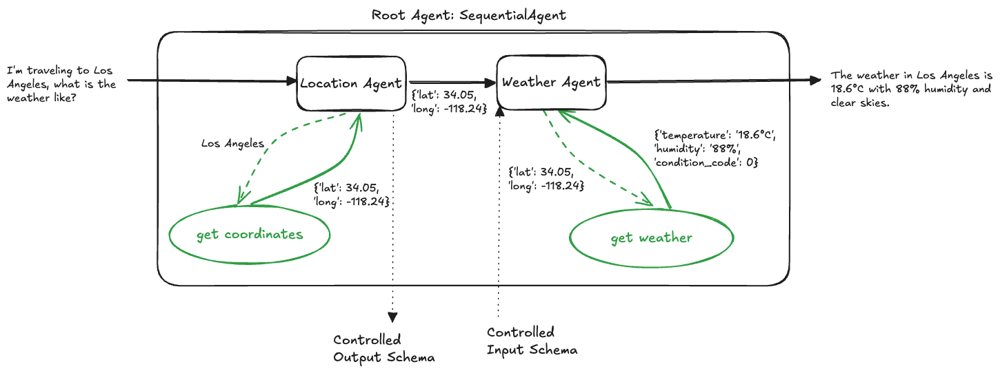

# 6. Sequential Agent (Google ADK)



This project demonstrates how to build a **Sequential Pipeline Multi-Agent Workflow** using the **Google Agent Development Kit (ADK)**.

In a sequential agent architecture, tasks are executed linearly through a predefined chain of specialized agents via `google.adk.agents.sequential_agent.SequentialAgent`. Control and structured data flow deterministically from one agent to the next, creating a reliable, typed pipeline where the structured output of an upstream agent feeds directly into the input schema of a downstream agent.

---

## Multi-Agent Architecture Comparison in ADK

| Feature | Hierarchical Agents (`4_hierarchical_agents`) | Agent as a Tool (`5_agent_as_a_tool`) | Sequential Agent (`6_sequential_agent`) |
| :--- | :--- | :--- | :--- |
| **Class** | `Agent(sub_agents=[...])` | `Agent(tools=[AgentTool(...)])` | `SequentialAgent(sub_agents=[...])` |
| **Execution Flow** | Dynamic / LLM-routed delegation. | Function tool calls within LLM turn. | **Deterministic, step-by-step pipeline**. |
| **Data Handoff** | Implicit conversational history. | Explicit `tool_context.state` dictionary. | **Typed Schema binding** (`output_schema` $\rightarrow$ `input_schema`). |
| **Best For** | Open-ended routing and flexible branching. | Enriching prompts with external agent tools. | Fixed, multi-stage pipelines and workflows. |

---

## Directory Overview

```
6_sequential_agent/
├── agent.png                   # Architectural diagram
├── agent.excalidraw            # Design diagram source
├── agents/
│   ├── location_agent/
│   │   ├── agent.py            # Location agent with output_schema=LocationAgentOutput
│   │   ├── prompt.py           # Geocoding instructions
│   │   ├── schema.py           # LocationAgentOutput Pydantic schema (latitude, longitude)
│   │   └── tools.py            # Geocoding tool (Open-Meteo API)
│   ├── weather_agent/
│   │   ├── agent.py            # Weather agent with input_schema=WeatherAgentInput
│   │   ├── prompt.py           # Weather instructions consuming {latitude?}, {longitude?}
│   │   ├── schema.py           # WeatherAgentInput Pydantic schema (latitude, longitude)
│   │   └── tools.py            # Weather forecast tool (Open-Meteo API)
│   └── root_agent/
│       ├── agent.py            # SequentialAgent definition chaining subagents
│       ├── main.py             # FastAPI service running the sequential pipeline
│       └── prompt.py           # Root agent prompt
├── tests/
│   └── root_agent/
│       └── test.py             # Integration tests verifying pipeline execution
└── utils/
    ├── logging.py              # Colored and structured logging configuration
    └── utils.py                # Environment configuration helper utilities
```

---

## How It Works: The Sequential Data Pipeline

```
 User Request: "What is the weather in Paris?"
                      │
                      ▼
┌───────────────────────────────────────────────────────────┐
│                     SequentialAgent                       │
│      sub_agents=[location_agent, weather_agent]           │
└─────────────────────────────┬─────────────────────────────┘
                              │
                              ▼
┌───────────────────────────────────────────────────────────┐
│               Stage 1: location_agent                     │
│  - Calls `get_coordinates("Paris")`                       │
│  - Produces structured output:                            │
│    LocationAgentOutput(latitude=48.8566, longitude=2.3522)│
└─────────────────────────────┬─────────────────────────────┘
                              │ (Schema Hand-off)
                              ▼
┌───────────────────────────────────────────────────────────┐
│               Stage 2: weather_agent                      │
│  - Consumes WeatherAgentInput(latitude, longitude)        │
│  - Calls `get_weather(48.8566, 2.3522)`                   │
│  - Generates final user-facing response                   │
└─────────────────────────────┬─────────────────────────────┘
                              │
                              ▼
 Final Response: "The current weather in Paris is 18.5°C..."
```

---

## Core Components

### 1. Sequential Root Agent (`agents/root_agent/agent.py`)

The pipeline coordinator uses `google.adk.agents.sequential_agent.SequentialAgent` to define the deterministic execution order of the subagents:

```python
from google.adk.agents.sequential_agent import SequentialAgent

from agents.location_agent.agent import location_agent
from agents.weather_agent.agent import weather_agent

root_agent = SequentialAgent(
    name='root_agent',
    description='A Workflow that answers user questions about the weather for specific location using available subagents.',
    sub_agents=[location_agent, weather_agent],
)
```

---

### 2. Stage 1: Location Subagent with Output Schema (`agents/location_agent/agent.py`)

The `location_agent` parses the user's message, resolves coordinates using `get_coordinates`, and strictly outputs structured data conforming to `LocationAgentOutput`:

#### Schema (`agents/location_agent/schema.py`):
```python
from pydantic import BaseModel, Field

class LocationAgentOutput(BaseModel):
    """Output schema for the location agent."""
    latitude: float = Field(description='Latitude of the location.')
    longitude: float = Field(description='Longitude of the location.')
```

#### Agent Definition (`agents/location_agent/agent.py`):
```python
from google.adk.agents.llm_agent import Agent
from agents.location_agent.tools import get_coordinates
from agents.location_agent.prompt import system_instruction
from agents.location_agent.schema import LocationAgentOutput

location_agent = Agent(
    model='gemini-2.5-flash',
    name='location_agent',
    description='A helpful assistant that answers user questions about the coordinates of a location.',
    instruction=system_instruction,
    tools=[get_coordinates],
    output_schema=LocationAgentOutput
)
```

---

### 3. Stage 2: Weather Subagent with Input Schema (`agents/weather_agent/agent.py`)

The `weather_agent` expects structured inputs conforming to `WeatherAgentInput`. ADK automatically injects the upstream coordinates into the agent's prompt context:

#### Schema (`agents/weather_agent/schema.py`):
```python
from pydantic import BaseModel, Field

class WeatherAgentInput(BaseModel):
    """Input schema for the weather agent."""
    latitude: float = Field(description='Latitude of the location.')
    longitude: float = Field(description='Longitude of the location.')
```

#### Prompt Template (`agents/weather_agent/prompt.py`):
```
You are a helpful assistant that answers user questions about the weather for specific coordinates.

You get input coordinates from the location agent or session state:
- Latitude: {latitude?}
- Longitude: {longitude?}

Use these coordinate values (or the coordinates returned by the location agent in the conversation) as inputs to the `get_weather` tool to report the weather.
```

#### Agent Definition (`agents/weather_agent/agent.py`):
```python
from google.adk.agents.llm_agent import Agent
from agents.weather_agent.tools import get_weather
from agents.weather_agent.prompt import system_instruction
from agents.weather_agent.schema import WeatherAgentInput

weather_agent = Agent(
    model='gemini-2.5-flash',
    name='weather_agent',
    description='A helpful assistant that answers user questions about the weather for a specific coordinates.',
    instruction=system_instruction,
    tools=[get_weather],
    input_schema=WeatherAgentInput
)
```

---

### 4. FastAPI Service (`agents/root_agent/main.py`)

The sequential agent workflow is served via **FastAPI**:
* `GET /`: Health check endpoint.
* `POST /run-root-agent`: Accepts `query: str`, creates an `InMemorySessionService` session, and runs the ADK `Runner` configured with `root_agent`. The runner iterates through all pipeline stages sequentially and returns the final response.

---

### 5. Integration Testing (`tests/root_agent/test.py`)

Integration tests use FastAPI's `TestClient` to verify end-to-end execution:
* **Health Check**: Validates `GET /` returns HTTP 200.
* **Pipeline Validation**: Tests queries (e.g., *"What is the weather like in Paris?"*, *"I'm traveling to Los Angeles, what is the weather like?"*) and verifies that coordinates flow from `location_agent` to `weather_agent` to produce accurate weather reports.

---

## Getting Started

### 1. Prerequisites & Environment Setup

Ensure you have Python 3.10+ installed.

Set up your Gemini API credentials in `agents/root_agent/.env`:
```bash
GEMINI_API_KEY="your-api-key"
```

---

### 2. Running Integration Tests

Run the integration test suite:

```bash
python3 tests/root_agent/test.py
```

---

### 3. Running the FastAPI Server

Start the API server:

```bash
python3 -m agents.root_agent.main
```
Or with Uvicorn:
```bash
uvicorn agents.root_agent.main:api --host 0.0.0.0 --port 8000 --reload
```

Interactive API documentation:
- Swagger UI: `http://localhost:8000/docs`
- Redoc: `http://localhost:8000/redoc`

---

### 4. Example API Request

```bash
curl -X POST "http://localhost:8000/run-root-agent?query=What%20is%20the%20weather%20in%20Rome?"
```
