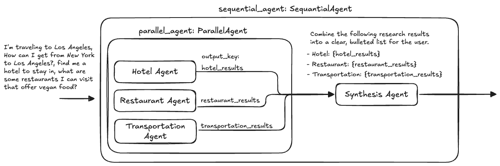

# 7. Parallel Agent & Synthesis Workflow (Google ADK)



This project demonstrates how to build a **Parallel Execution and Synthesis Workflow (Fan-Out / Fan-In)** using the **Google Agent Development Kit (ADK)**.

By combining `google.adk.agents.parallel_agent.ParallelAgent` with `google.adk.agents.sequential_agent.SequentialAgent`, the system runs multiple specialized subagents concurrently across independent domains (hotels, restaurants, transportation) and then aggregates their outputs into a unified response using a synthesis agent.

---

## Multi-Agent Architecture Comparison in ADK

| Pattern | Class | Control & Execution Model | Data Handoff Mechanism |
| :--- | :--- | :--- | :--- |
| **Hierarchical** (`4_hierarchical_agents`) | `Agent(sub_agents=[...])` | Dynamic LLM routing / delegation. | Conversational message history. |
| **Agent as a Tool** (`5_agent_as_a_tool`) | `Agent(tools=[AgentTool(...)])` | Root agent calls other agents as tools. | `tool_context.state` dictionary. |
| **Sequential** (`6_sequential_agent`) | `SequentialAgent(sub_agents=[...])` | Linear, deterministic step-by-step pipeline. | `output_schema` $\rightarrow$ `input_schema` binding. |
| **Parallel + Synthesis** (`7_parallel_agent`) | `ParallelAgent` + `SequentialAgent` | **Concurrent fan-out execution** followed by a sequential **fan-in synthesis**. | `output_key` state storage $\rightarrow$ prompt template injection. |

---

## Directory Overview

```
7_parallel_agent/
├── agent.png                   # Architecture diagram
├── agent.excalidraw            # Design diagram source
├── agents/
│   ├── hotel_agent/
│   │   ├── agent.py            # Hotel agent with output_key="hotel_results"
│   │   └── prompt.py           # Hotel search instructions
│   ├── restaurant_agent/
│   │   ├── agent.py            # Restaurant agent with output_key="restaurant_results"
│   │   └── prompt.py           # Restaurant search instructions
│   ├── transportation_agent/
│   │   ├── agent.py            # Transportation agent with output_key="transportation_results"
│   │   └── prompt.py           # Transportation search instructions
│   ├── parallel_agent/
│   │   └── agent.py            # ParallelAgent(sub_agents=[hotel, restaurant, transportation])
│   ├── synthesis_agent/
│   │   ├── agent.py            # Synthesis agent definition
│   │   └── prompt.py           # Synthesis prompt consuming {hotel_results}, {restaurant_results}, {transportation_results}
│   └── sequential_agent/
│       ├── agent.py            # SequentialAgent chaining [parallel_agent, synthesis_agent]
│       └── main.py             # FastAPI service running the combined workflow
├── tests/
│   └── sequential_agent/
│       └── test.py             # Integration test for the parallel-synthesis pipeline
└── utils/
    ├── logging.py              # Colored and structured logging configuration
    └── utils.py                # Environment configuration helper utilities
```

---

## How It Works: Fan-Out / Fan-In Workflow

```
 User Request: "Plan my trip from NY to LA: hotel, vegan food, and travel options."
                                      │
                                      ▼
             ┌─────────────────────────────────────────────────┐
             │       Step 1: Parallel Fan-Out (ParallelAgent)  │
             │   Runs all 3 subagents concurrently in parallel │
             └────────────────────────┬────────────────────────┘
                                      │
              ┌───────────────────────┼───────────────────────┐
              ▼                       ▼                       ▼
   ┌──────────────────────┐┌──────────────────────┐┌──────────────────────┐
   │     hotel_agent      ││   restaurant_agent   ││ transportation_agent │
   │  output_key:         ││  output_key:         ││  output_key:         │
   │  "hotel_results"     ││  "restaurant_results"││  "transportation_...│
   └──────────┬───────────┘└──────────┬───────────┘└──────────┬───────────┘
              │                       │                       │
              └───────────────────────┼───────────────────────┘
                                      ▼
             ┌─────────────────────────────────────────────────┐
             │           Session State (Blackboard)            │
             │ - hotel_results: "..."                          │
             │ - restaurant_results: "..."                     │
             │ - transportation_results: "..."                 │
             └────────────────────────┬────────────────────────┘
                                      │
                                      ▼
             ┌─────────────────────────────────────────────────┐
             │       Step 2: Fan-In Synthesis (synthesis_agent)│
             │  Combines results into a single formatted list  │
             └────────────────────────┬────────────────────────┘
                                      │
                                      ▼
                      Final Synthesized Trip Plan
```

---

## Core Components

### 1. Parallel Subagents & `output_key`

Each subagent focuses on a single domain and specifies an `output_key`. When the subagent completes its run, ADK saves its generated response in the session state under that key:

* **Hotel Agent (`agents/hotel_agent/agent.py`)**:
  ```python
  hotel_agent = Agent(
      model='gemini-2.5-flash',
      name='hotel_agent',
      description='An agent that answers user questions about hotel availability in a given location.',
      instruction=system_instruction,
      output_key="hotel_results"
  )
  ```

* **Restaurant Agent (`agents/restaurant_agent/agent.py`)**:
  ```python
  restaurant_agent = Agent(
      model='gemini-2.5-flash',
      name='restaurant_agent',
      description='A helpful assistant that retrieves restaurant recommendations based on cuisine type and optionally a location.',
      instruction=system_instruction,
      output_key="restaurant_results"
  )
  ```

* **Transportation Agent (`agents/transportation_agent/agent.py`)**:
  ```python
  transportation_agent = Agent(
      model='gemini-2.5-flash',
      name='transportation_agent',
      description='An agent that answers user questions about transportation options for getting from one location to another location.',
      instruction=system_instruction,
      output_key="transportation_results"
  )
  ```

---

### 2. Parallel Orchestrator (`agents/parallel_agent/agent.py`)

`ParallelAgent` groups the subagents and executes them concurrently:

```python
from google.adk.agents.parallel_agent import ParallelAgent
from agents.hotel_agent.agent import hotel_agent
from agents.restaurant_agent.agent import restaurant_agent
from agents.transportation_agent.agent import transportation_agent

parallel_agent = ParallelAgent(
    name='parallel_agent',
    sub_agents=[hotel_agent, restaurant_agent, transportation_agent],
)
```

---

### 3. Synthesis Agent (`agents/synthesis_agent/agent.py`)

The `synthesis_agent` takes the accumulated state from the parallel stage and combines the findings into a clean, formatted response.

#### Prompt (`agents/synthesis_agent/prompt.py`):
```
You are a helpful assistant. Combine the following research results into a clear, bulleted list for the user.
    - Hotel: {hotel_results}
    - Restaurant: {restaurant_results}
    - Transportation: {transportation_results}
```

#### Agent Definition (`agents/synthesis_agent/agent.py`):
```python
from google.adk.agents.llm_agent import Agent
from agents.synthesis_agent.prompt import system_instruction

synthesis_agent = Agent(
    model="gemini-2.5-flash",
    name='synthesis_agent',
    description="An agent workflow that finds multiple things in parallel and then synthesizes the results.",
    instruction=system_instruction,
)
```

---

### 4. Sequential Root Pipeline (`agents/sequential_agent/agent.py`)

A `SequentialAgent` links the parallel fan-out stage with the synthesis fan-in stage:

```python
from google.adk.agents.sequential_agent import SequentialAgent
from agents.parallel_agent.agent import parallel_agent
from agents.synthesis_agent.agent import synthesis_agent

sequential_agent = SequentialAgent(
    name='sequential_agent',
    sub_agents=[parallel_agent, synthesis_agent],
    description="An agent workflow that finds multiple things in parallel and then synthesizes the results."
)
```

---

### 5. FastAPI Service (`agents/sequential_agent/main.py`)

Exposes a REST API service using **FastAPI**:
* `GET /`: Health check endpoint.
* `POST /run-sequential-agent`: Accepts `query: str`, initializes an `InMemorySessionService`, and executes the `SequentialAgent` (which first runs `ParallelAgent` across all 3 domain agents, then runs `synthesis_agent` to return the combined result).

---

### 6. Integration Testing (`tests/sequential_agent/test.py`)

The test script validates the end-to-end parallel synthesis flow using FastAPI's `TestClient`:
* Sends a composite multi-intent travel query:
  *"I'm traveling to Los Angeles, How can I get from New York to Los Angeles?, find me a hotel to stay in, what are some restaurants I can visit that offer vegan food?"*
* Verifies that the service returns HTTP 200 and a comprehensive synthesized answer covering hotel options, restaurant recommendations, and transportation choices.

---

## Getting Started

### 1. Prerequisites & Environment Setup

Ensure you have Python 3.10+ installed.

Set up your Gemini API credentials in `agents/sequential_agent/.env`:
```bash
GEMINI_API_KEY="your-api-key"
```

---

### 2. Running Integration Tests

Run the test suite verifying the parallel and synthesis pipeline:

```bash
python3 tests/sequential_agent/test.py
```

---

### 3. Running the FastAPI Server

Start the API server:

```bash
python3 -m agents.sequential_agent.main
```
Or with Uvicorn:
```bash
uvicorn agents.sequential_agent.main:api --host 0.0.0.0 --port 8003 --reload
```

Interactive API documentation:
- Swagger UI: `http://localhost:8003/docs`
- Redoc: `http://localhost:8003/redoc`

---

### 4. Example API Request

```bash
curl -X POST "http://localhost:8003/run-sequential-agent?query=I%27m%20planning%20a%20trip%20to%20Tokyo%20from%20San%20Francisco.%20Find%20me%20a%20hotel%2C%20sushi%20restaurants%2C%20and%20flight%20options."
```
