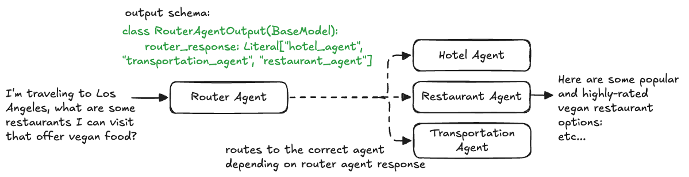

# 8. Router Agent (Google ADK)



This project demonstrates the **Router Agent Architecture (Intent Classification & Microservice Routing)** using the **Google Agent Development Kit (ADK)** and **FastAPI**.

In this pattern, a dedicated **Router Agent** analyzes the incoming user request, determines the underlying intent, and dynamically routes the query to the appropriate domain-specific agent microservice (`hotel_agent`, `restaurant_agent`, or `transportation_agent`) using a controlled Pydantic output schema and asynchronous HTTP dispatching.

---

## Multi-Agent Architecture Comparison in ADK

| Pattern | Class / Structure | Control & Execution Model | Routing & Handoff Mechanism |
| :--- | :--- | :--- | :--- |
| **Hierarchical** (`4_hierarchical_agents`) | `Agent(sub_agents=[...])` | Orchestration via LLM delegation. | In-memory agent context. |
| **Agent as a Tool** (`5_agent_as_a_tool`) | `Agent(tools=[AgentTool(...)])` | Subagents exposed as function tools. | `tool_context.state` dictionary. |
| **Sequential** (`6_sequential_agent`) | `SequentialAgent(sub_agents=[...])` | Deterministic, step-by-step pipeline. | `output_schema` $\rightarrow$ `input_schema` binding. |
| **Parallel + Synthesis** (`7_parallel_agent`) | `ParallelAgent` + `SequentialAgent` | Concurrent fan-out + fan-in aggregation. | `output_key` state accumulation $\rightarrow$ synthesis prompt. |
| **Router Agent** (`8_router_agent`) | `Agent(output_schema=...)` + REST APIs | **Dynamic intent classification & branching**. | **Pydantic Enum Output** $\rightarrow$ **REST/HTTP Dispatch**. |

---

## Directory Overview

```
8_router_agent/
├── agent.png                   # Architecture diagram
├── agent.excalidraw            # Design diagram source
├── agents/
│   ├── hotel_agent/
│   │   ├── agent.py            # Hotel specialist agent
│   │   ├── main.py             # Standalone FastAPI service (Port 8001)
│   │   └── prompt.py           # Hotel domain instructions
│   ├── restaurant_agent/
│   │   ├── agent.py            # Restaurant specialist agent
│   │   ├── main.py             # Standalone FastAPI service (Port 8000)
│   │   └── prompt.py           # Restaurant domain instructions
│   ├── transportation_agent/
│   │   ├── agent.py            # Transportation specialist agent
│   │   ├── main.py             # Standalone FastAPI service (Port 8002)
│   │   └── prompt.py           # Transportation domain instructions
│   └── router_agent/
│       ├── agent.py            # Router agent with output_schema=RouterAgentOutput
│       ├── main.py             # Router FastAPI gateway (Port 8003) with HTTP dispatching
│       ├── prompt.py           # Classification instructions
│       └── schema.py           # RouterAgentOutput schema (Literal enum)
├── tests/
│   └── router_agent/
│       └── test.py             # Integration test verifying multi-intent routing
└── utils/
    ├── logging.py              # Colored and structured logging configuration
    └── utils.py                # Environment configuration helper utilities
```

---

## How It Works: Dynamic Microservice Routing

```
                            User Query
                                │
                                ▼
               ┌─────────────────────────────────┐
               │          Router Agent           │
               │   (Classifies user's intent)    │
               │  output_schema=RouterAgentOutput│
               └────────────────┬────────────────┘
                                │
        ┌───────────────────────┼───────────────────────┐
        │ "hotel_agent"         │ "transportation_agent"│ "restaurant_agent"
        ▼                       ▼                       ▼
┌─────────────────┐     ┌─────────────────┐     ┌─────────────────┐
│   Hotel Agent   │     │ Transportation  │     │Restaurant Agent │
│   Microservice  │     │      Agent      │     │  Microservice   │
│   (Port 8001)   │     │   (Port 8002)   │     │   (Port 8000)   │
└────────┬────────┘     └────────┬────────┘     └────────┬────────┘
         │                       │                       │
         └───────────────────────┼───────────────────────┘
                                 ▼
                          Final Response
```

---

## Core Components

### 1. Controlled Router Output Schema (`agents/router_agent/schema.py`)

The routing decision is enforced through a strict Pydantic model using `Literal` typing to ensure the agent outputs only valid service names:

```python
from pydantic import BaseModel, Field
from typing import Literal

class RouterAgentOutput(BaseModel):
    router_response: Literal["hotel_agent", "transportation_agent", "restaurant_agent"] = Field(
        ..., 
        description="The decision of the router agent."
    )
```

---

### 2. Router Agent Definition (`agents/router_agent/agent.py`)

The router agent binds the classification prompt and the output schema to `gemini-2.5-flash`:

```python
from google.adk.agents.llm_agent import Agent
from agents.router_agent.prompt import system_instruction
from agents.router_agent.schema import RouterAgentOutput

router_agent = Agent(
    model='gemini-2.5-flash',
    name='router_agent',
    description="An agent that routes user questions to the appropriate sub-agent based on the user's intent.",
    instruction=system_instruction,
    output_schema=RouterAgentOutput,
)
```

#### Classification Prompt (`agents/router_agent/prompt.py`):
```
You are a router agent, your job is to take user's query and decide which sub agent to use.
You can use one of the following agents: 
- hotel_agent: For hotel-related queries
- transportation_agent: For transportation-related queries
- restaurant_agent: For restaurant-related queries
```

---

### 3. Specialist Domain Agents

Each specialized agent runs as an independent unit with focused domain knowledge:

* **Hotel Agent (`agents/hotel_agent/`)**: Answers inquiries regarding hotel availability, booking, and accommodations (runs on port `8001`).
* **Restaurant Agent (`agents/restaurant_agent/`)**: Recommends dining options and restaurants based on cuisine and location (runs on port `8000`).
* **Transportation Agent (`agents/transportation_agent/`)**: Provides transit routes, flight guidance, and travel options (runs on port `8002`).

---

### 4. Router API Gateway & Dispatcher (`agents/router_agent/main.py`)

The router service acts as an intelligent API Gateway:
1. Receives the user request on `POST /run-router-agent`.
2. Runs the `router_agent` via the ADK `Runner` to classify the query.
3. Parses the structured JSON decision (`router_response`).
4. Dispatches an asynchronous HTTP request using `httpx.AsyncClient` to the corresponding agent endpoint:
   - `hotel_agent` $\rightarrow$ `http://localhost:8001/run-hotel-agent`
   - `transportation_agent` $\rightarrow$ `http://localhost:8002/run-transportation-agent`
   - `restaurant_agent` $\rightarrow$ `http://localhost:8000/run-restaurant-agent`
5. Returns the domain specialist's response to the client.

```python
AGENT_ENDPOINTS = {
    "hotel_agent": "http://localhost:8001/run-hotel-agent",
    "transportation_agent": "http://localhost:8002/run-transportation-agent",
    "restaurant_agent": "http://localhost:8000/run-restaurant-agent",
}
```

---

### 5. Integration Testing (`tests/router_agent/test.py`)

The test script validates that different user intents are accurately classified and answered:
* **Transportation Intent**: *"How can I get from New York to Los Angeles?"*
* **Hotel Intent**: *"I'm traveling to Los Angeles, find me a hotel to stay in."*
* **Restaurant Intent**: *"I'm traveling to Los Angeles, what are some restaurants I can visit that offer vegan food?"*

---

## Getting Started

### 1. Prerequisites & Environment Setup

Ensure you have Python 3.10+ installed.

Set up your Gemini API credentials in `agents/router_agent/.env` (and each subagent `.env` if running separately):
```bash
GEMINI_API_KEY="your-api-key"
```

---

### 2. Running the Agent Services

To run the complete distributed setup, start each specialist service on its respective port, followed by the router gateway:

```bash
# Terminal 1: Start Restaurant Agent (Port 8000)
python3 -m agents.restaurant_agent.main

# Terminal 2: Start Hotel Agent (Port 8001)
python3 -m agents.hotel_agent.main

# Terminal 3: Start Transportation Agent (Port 8002)
python3 -m agents.transportation_agent.main

# Terminal 4: Start Router Agent Gateway (Port 8003)
python3 -m agents.router_agent.main
```

---

### 3. Running Integration Tests

With the subagent services running, execute the test suite:

```bash
python3 tests/router_agent/test.py
```

---

### 4. Example API Request

Send a request directly to the Router Gateway on port 8003:

```bash
# Example 1: Hotel inquiry (Routed to Hotel Agent)
curl -X POST "http://localhost:8003/run-router-agent?query=Find%20me%20a%20luxury%20hotel%20in%20Rome"

# Example 2: Dining inquiry (Routed to Restaurant Agent)
curl -X POST "http://localhost:8003/run-router-agent?query=Best%20Italian%20restaurants%20near%20downtown"

# Example 3: Travel inquiry (Routed to Transportation Agent)
curl -X POST "http://localhost:8003/run-router-agent?query=What%20is%20the%20fastest%20way%20to%20travel%20from%20London%20to%20Paris?"
```
