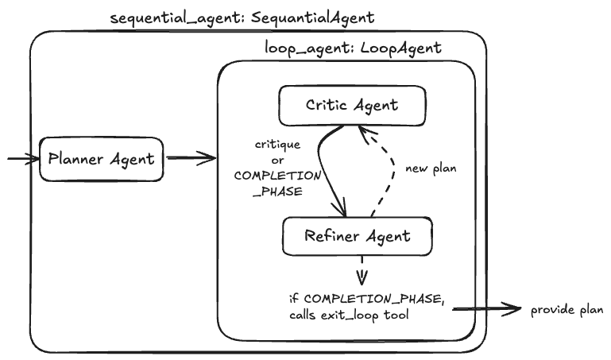

# 9. Loop Agent & Iterative Refinement Workflow (Google ADK)



This project demonstrates how to build an **Iterative Refinement Multi-Agent Loop (Planner-Critic-Refiner Pattern)** using the **Google Agent Development Kit (ADK)**.

By combining `google.adk.agents.loop_agent.LoopAgent` with `google.adk.agents.sequential_agent.SequentialAgent`, the system automatically generates an initial plan, evaluates it against strict constraints using external search tools, and iteratively refines the plan in a feedback loop until quality criteria are satisfied or an exit condition is triggered.

---

## Multi-Agent Architecture Comparison in ADK

| Pattern | Class / Structure | Control & Execution Model | Data Handoff & Flow Mechanism |
| :--- | :--- | :--- | :--- |
| **Hierarchical** (`4_hierarchical_agent`) | `Agent(sub_agents=[...])` | Dynamic LLM orchestration & delegation. | Conversational context & subagent calls. |
| **Agent as a Tool** (`5_agent_as_a_tool`) | `Agent(tools=[AgentTool(...)])` | Subagents wrapped as callable function tools. | `tool_context.state` dictionary. |
| **Sequential** (`6_sequential_agent`) | `SequentialAgent(sub_agents=[...])` | Linear, deterministic step-by-step pipeline. | `output_schema` $\rightarrow$ `input_schema` binding. |
| **Parallel + Synthesis** (`7_parallel_agent`) | `ParallelAgent` + `SequentialAgent` | Concurrent fan-out + fan-in synthesis. | `output_key` state accumulation $\rightarrow$ prompt template. |
| **Router Agent** (`8_router_agent`) | `Agent(output_schema=...)` + REST APIs | Dynamic intent classification & branching. | Pydantic Enum Output $\rightarrow$ REST/HTTP Dispatch. |
| **Loop Agent** (`9_loop_agent`) | `LoopAgent` + `SequentialAgent` | **Iterative feedback cycle with condition-based exit**. | **State keys (`current_plan`, `criticism`) + `tool_context.actions.escalate = True`**. |

---

## Directory Overview

```
9_loop_agent/
├── agent.png                   # Architecture diagram
├── agent.excalidraw            # Design diagram source
├── agents/
│   ├── planner_agent/
│   │   ├── agent.py            # Planner agent (proposes initial itinerary, output_key="current_plan")
│   │   └── prompt.py           # Planning instructions
│   ├── critic_agent/
│   │   ├── agent.py            # Critic agent (verifies travel constraints via google_search, output_key="criticism")
│   │   └── prompt.py           # Evaluation rules and COMPLETION_PHRASE
│   ├── refiner_agent/
│   │   ├── agent.py            # Refiner agent with exit_loop tool
│   │   └── prompt.py           # Refinement instructions
│   ├── loop_agent/
│   │   └── agent.py            # LoopAgent(sub_agents=[critic_agent, refiner_agent], max_iterations=3)
│   └── sequential_agent/
│       ├── agent.py            # SequentialAgent chaining [planner_agent, loop_agent]
│       └── main.py             # FastAPI service running the sequential loop workflow
├── tests/
│   └── sequantial_agent/
│       └── test.py             # Integration test for the iterative loop workflow
└── utils/
    ├── logging.py              # Colored and structured logging configuration
    └── utils.py                # Environment configuration helper utilities
```

---

## How It Works: The Iterative Refinement Cycle

```
                       User Request: "Propose an itinerary in San Francisco"
                                                 │
                                                 ▼
             ┌───────────────────────────────────────────────────────────────────────┐
             │                          SequentialAgent                              │
             │               sub_agents=[planner_agent, loop_agent]                  │
             └───────────────────────────────────┬───────────────────────────────────┘
                                                 │
                                                 ▼
             ┌───────────────────────────────────────────────────────────────────────┐
             │                     Stage 1: Initial Planning                         │
             │                     planner_agent (Google Search)                     │
             │     Generates: Activity + Restaurant (saved to `current_plan`)        │
             └───────────────────────────────────┬───────────────────────────────────┘
                                                 │
                                                 ▼
             ┌───────────────────────────────────────────────────────────────────────┐
             │              Stage 2: Iterative Feedback Loop (LoopAgent)             │
             │                       max_iterations = 3                              │
             │                                                                       │
             │       ┌──────────────────────────────────────────────────────┐        │
             │       │                   critic_agent                       │        │
             │       │  - Checks transit time between activity & restaurant │        │
             │       │  - IF > 30 mins: Outputs critique                    │        │
             │       │  - ELSE: Outputs COMPLETION_PHRASE                   │        │
             │       └──────────────────────────┬───────────────────────────┘        │
             │                                  │                                    │
             │                                  ▼                                    │
             │       ┌──────────────────────────────────────────────────────┐        │
             │       │                   refiner_agent                      │        │
             │       │  - IF approved: Calls `exit_loop()` (escalate=True)  │        │
             │       │  - ELSE: Generates new plan -> loop repeats          │        │
             │       └──────────────────────────────────────────────────────┘        │
             └───────────────────────────────────┬───────────────────────────────────┘
                                                 │ (Loop exits)
                                                 ▼
                              Approved & Verified Final Itinerary
```

---

## Core Components

### 1. Initial Planner Agent (`agents/planner_agent/agent.py`)

The `planner_agent` generates the initial candidate plan using `google_search` grounding and stores the result under `output_key="current_plan"`:

```python
from google.adk.agents.llm_agent import Agent
from google.adk.tools import google_search
from agents.planner_agent.prompt import system_instruction

planner_agent = Agent(
    name="planner_agent",
    model="gemini-2.5-flash",
    tools=[google_search],
    instruction=system_instruction,
    output_key="current_plan"
)
```

#### Prompt (`agents/planner_agent/prompt.py`):
```python
system_instruction = """"You are a trip planner. Based on the user's request, propose a single activity and a single restaurant. Output only the names, like: 'Activity: Exploratorium, Restaurant: La Mar'."""
```

---

### 2. Critic Agent (`agents/critic_agent/agent.py`)

The `critic_agent` evaluates `{current_plan}` against strict constraints (e.g., travel time between activity and dining spot under 30 minutes) using `google_search`:

```python
from google.adk.agents.llm_agent import Agent
from google.adk.tools import google_search
from agents.critic_agent.prompt import system_instruction

critic_agent = Agent(
    name="critic_agent",
    model="gemini-2.5-flash",
    tools=[google_search],
    instruction=system_instruction,
    output_key="criticism"
)
```

#### Evaluation Rules (`agents/critic_agent/prompt.py`):
```python
COMPLETION_PHRASE = "The plan is feasible and meets all constraints."

system_instruction = f"""You are a logistics expert. Your job is to critique a travel plan. The user has a strict constraint: total travel time must be short.
    Current Plan: {{current_plan}}
    Use your tools to check the travel time between the two locations.
    IF the travel time is over 30 minutes, provide a critique, like: 'This plan is inefficient. Find a restaurant closer to the activity.'
    ELSE, respond with the exact phrase: '{COMPLETION_PHRASE}'"""
```

---

### 3. Refiner Agent & Early Exit Tool (`agents/refiner_agent/agent.py`)

The `refiner_agent` reads `{criticism}`. If the plan meets all constraints, it triggers the `exit_loop` tool to break out of `LoopAgent`. Otherwise, it generates an updated plan:

```python
from google.adk.agents.llm_agent import Agent
from google.adk.tools import ToolContext
from agents.refiner_agent.prompt import system_instruction

def exit_loop(tool_context: ToolContext):
    """Call this function ONLY when the plan is approved, signaling the loop should end."""
    print(f"  [Tool Call] exit_loop triggered by {tool_context.agent_name}")
    # Signal ADK LoopAgent to break the loop
    tool_context.actions.escalate = True
    return {}

refiner_agent = Agent(
    name="refiner_agent",
    model="gemini-2.5-flash",
    tools=[exit_loop],
    instruction=system_instruction,
    output_key="current_plan"
)
```

#### Refinement Prompt (`agents/refiner_agent/prompt.py`):
```python
COMPLETION_PHRASE = "The plan is feasible and meets all constraints."

system_instruction = f"""You are a trip planner, refining a plan based on criticism.
    Original Request: {{session.query}}
    Critique: {{criticism}}
    IF the critique is '{COMPLETION_PHRASE}', you MUST call the 'exit_loop' tool.
    ELSE, generate a NEW plan that addresses the critique. Output only the new plan names, like: 'Activity: de Young Museum, Restaurant: Nopa'."""
```

---

### 4. Loop & Sequential Orchestration

* **Loop Agent (`agents/loop_agent/agent.py`)**:
  Wraps `critic_agent` and `refiner_agent` with a safety threshold `max_iterations=3`:
  ```python
  from google.adk.agents.loop_agent import LoopAgent
  from agents.critic_agent.agent import critic_agent
  from agents.refiner_agent.agent import refiner_agent

  loop_agent = LoopAgent(
      name="loop_agent",
      sub_agents=[critic_agent, refiner_agent],
      max_iterations=3
  )
  ```

* **Sequential Coordinator (`agents/sequential_agent/agent.py`)**:
  Links the initial planning stage and the loop refinement stage:
  ```python
  from google.adk.agents.sequential_agent import SequentialAgent
  from agents.planner_agent.agent import planner_agent
  from agents.loop_agent.agent import loop_agent

  sequential_agent = SequentialAgent(
      name="sequential_agent",
      sub_agents=[planner_agent, loop_agent],
      description="A workflow that iteratively plans and refines a trip to meet constraints."
  )
  ```

---

### 5. FastAPI Service (`agents/sequential_agent/main.py`)

Exposes a REST API service:
* `GET /`: Health check endpoint.
* `POST /run-sequantial-agent`: Accepts `query: str`, creates an `InMemorySessionService`, and executes the complete `sequential_agent` runner, returning the final verified plan.

---

### 6. Integration Testing (`tests/sequantial_agent/test.py`)

Tests the full iterative loop flow with FastAPI's `TestClient`:
* Runs `"Propose an itinerary in San Francisco"`.
* Observes the agent generating an initial plan $\rightarrow$ evaluating transit distance via Google Search $\rightarrow$ refining when distance exceeds limits $\rightarrow$ exiting once optimal and returning the verified itinerary.

---

## Getting Started

### 1. Prerequisites & Environment Setup

Ensure you have Python 3.10+ installed.

Set up your Gemini API credentials in `agents/sequential_agent/.env`:
```bash
GEMINI_API_KEY="your-api-key"
```

---

### 2. Running Integration Tests

Run the integration test suite:

```bash
python3 tests/sequantial_agent/test.py
```

---

### 3. Running the FastAPI Server

Start the API server:

```bash
python3 -m agents.sequential_agent.main
```
Or with Uvicorn:
```bash
uvicorn agents.sequential_agent.main:api --host 0.0.0.0 --port 8000 --reload
```

Interactive API documentation:
- Swagger UI: `http://localhost:8000/docs`
- Redoc: `http://localhost:8000/redoc`

---

### 4. Example API Request

```bash
curl -X POST "http://localhost:8000/run-sequantial-agent?query=Propose%20an%20itinerary%20in%20San%20Francisco"
```
